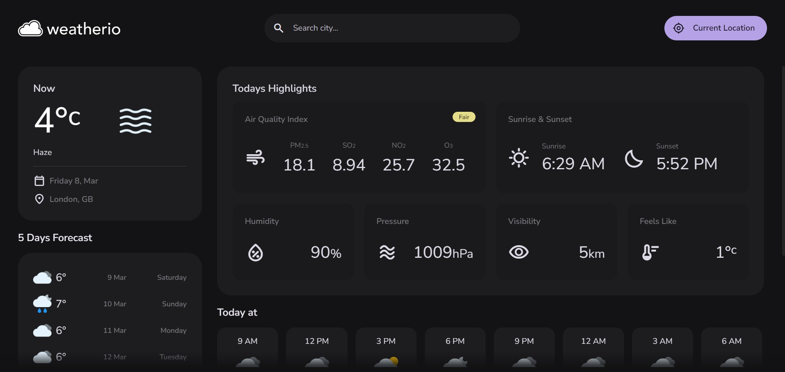

# Project Title

REAL TIME WEATHER FORECASTING

# Objective

This project aims to develop a Real Time Weather Forecasting system utilizing a weather API for fetching live data. The user interface will be built using HTML, CSS, and pure Vanilla JavaScript to create an intuitive and responsive platform.

## Tech Stack

**Client:** HTML, CSS, JavaScript, API

## Demo

Insert gif or link to demo

## Features

- 1. Live Data Retrieval: Utilize a weather API to fetch real-time weather updates.

- 2. User-Friendly Interface: Design an intuitive and visually appealing UI using HTML, CSS, and Vanilla JS.

- 3. Responsive Design: Ensure compatibility across various devices for a seamless user experience.

- 4. Location-Based Forecast: Allow users to input their location or automatically detect it for personalized weather updates. 

- 5. Detailed Information: Display crucial weather parameters such as temperature, humidity, wind speed, and forecasts.

## Screenshots



## Run Locally

Clone the project

```bash
  git clone https://link-to-project
```

Go to the project directory

```bash
  cd my-project
```

Open with VSCode

```bash
  code .
```

Open with live server

```bash
  npm run start
```


## Authors

- [@santosh-bhaykatte](https://github.com/santosh-bhaykatte)

## License

[MIT](https://choosealicense.com/licenses/mit/)
